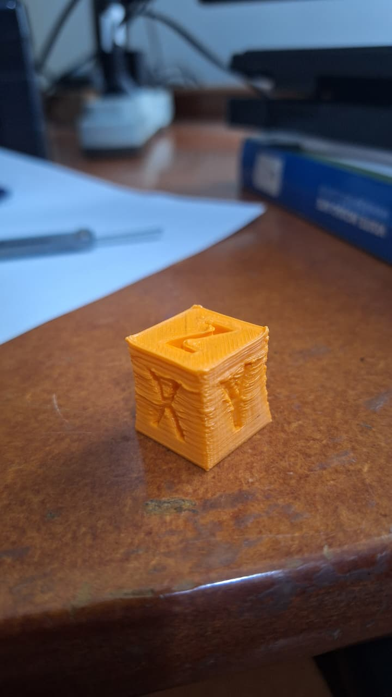
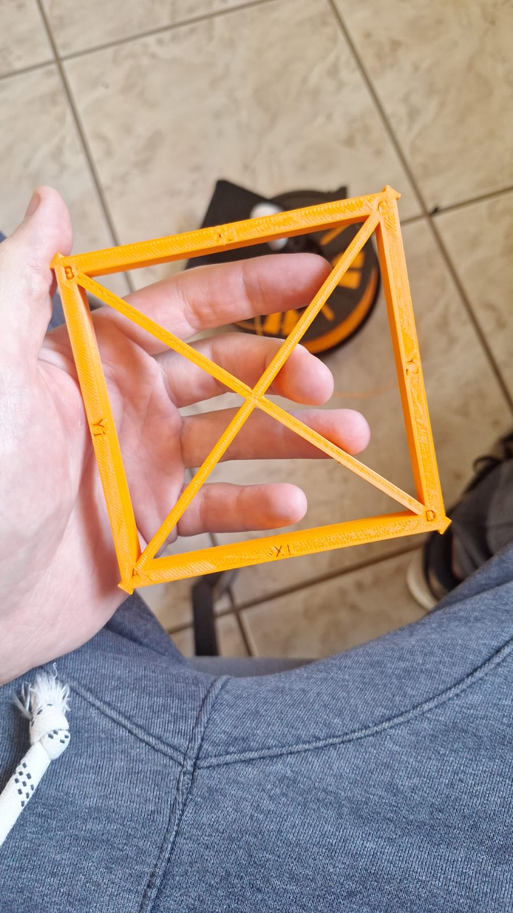
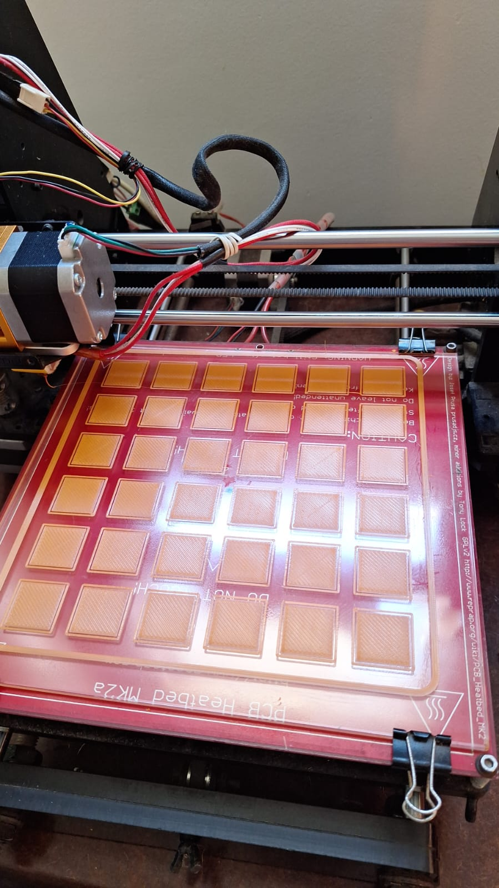
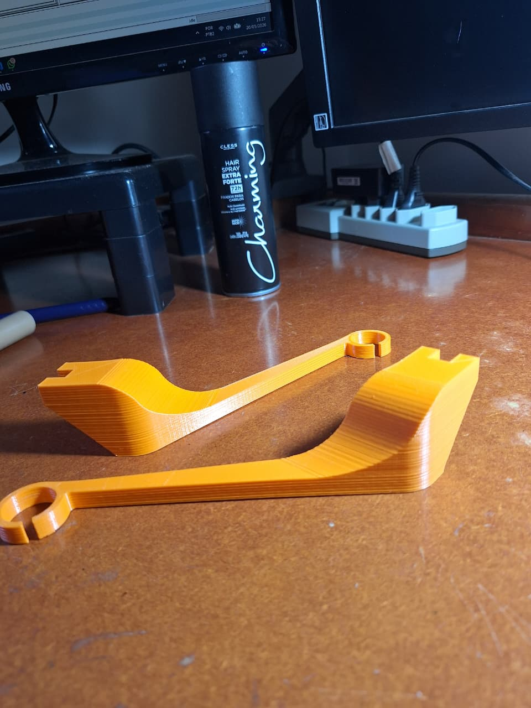
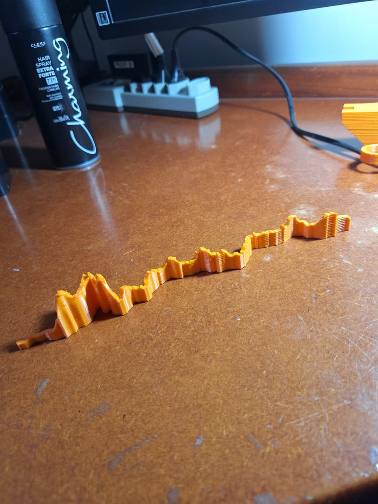
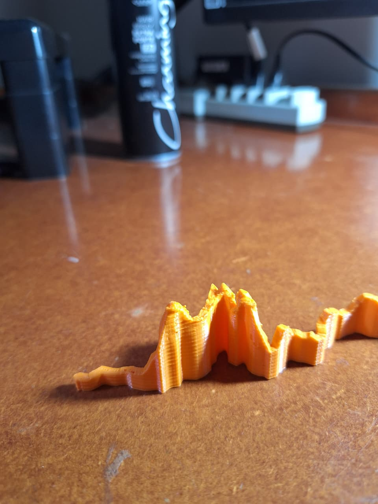
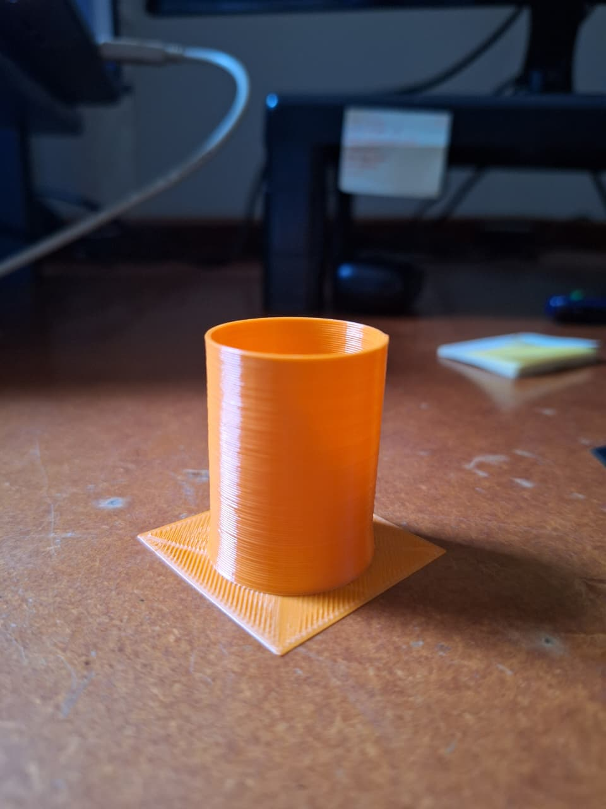

# Diário de trabalho

Neste diário vou documentar problemas, soluções, descobertas etc. ao longo dos dias pra evitar a raiva - que estou passando enquanto crio esse documento 🤦‍♂️ - de solucionar as coisas e esquecer depois como fiz.

## 23/05/2025

- **PROBLEMA:** A impressora não comunica quando espeto o USB. Reinicia quando isso acontece, então aparentemente a conexão física está boa, mas a comunicação dá timeout.
- Acabei de instalar o Repetier Host pela primeira vez nessa máquina
- Talvez reinicie ela do zero. Esses são os steps/mm após calibração (com régua):
  - X: 80.1
  - Y: 80.1
  - Z: 2573.5
  - E: 95.5
- Resolvi configurar do 0 novamente. Baixei o [Auto Build Marlin](https://marlinfw.org/docs/basics/auto_build_marlin.html) e descobri que tem um [repo deles](https://github.com/MarlinFirmware/Configurations/tree/release-2.1.2.1/config/examples) com exemplos de várias impressoras, inclusive a minha.
  - **IMPORTANTE:** Se pegar link de algum fórum, conferir se é o exemplo do release que estou usando ou vai dar erro de versão (deu kkkkk)
- Apanhei pra descobrir se a minha é do tipo threaded rod ou lead screw - estou chutando threaded rod
- Estou desabilitando `SKEW_CORRECTION` p/ fazer uns testes. Tenho que reabilitar, arrumar um paquímetro e fazer a calibração quando o filamento novo chegar.
- Recap das coisas que quero fazer ainda:
  - Calibration cube e skew factor com paquímetro
  - Guia p/ filamento
  - Suporte p/ cooler do bico e BLTouch
  - Configurar firmware com BLTouch (instruções [aqui](https://github.com/MarlinFirmware/Configurations/tree/release-2.1.2.1/config/examples/Geeetech/Prusa%20i3%20Pro%20B/noprobe#3dtouch-auto-leveling-sensor))
  - Porta controles
- Tem duas arquiteturas p/ a placa dessa impressora: 2560 e 1280. No chip está escrito ATMega2560 então vou no 2560.
- Consegui fazer o upload do firmware e atualizei manualmente pela IHM os steps/mm
- No fim das contas, não estava respondendo pq o baud rate estava errado. **O baud rate dessa impressora é 250k.**
- **PROBLEMA:** Clico pra habilitar o bico no controle manual do Repetier e ele imediatamente desabilita. Temperatura máxima do bico estava configurada em 0 graus. Alterei, fucei alterando pela impressora e depois pelo software e deu certo.
- Tive que ajustar velocidade do eixo Z e velocidade de extrusão manual - Printer Settings > Printer > Z-Axis Feed Rate (100 -> 200)/Manual Extrustion Speed (1000 -> 100)
- GCode p/ permitir cold extrusion (útil p/ fazer cold pull): `M302 P` [[docs](https://marlinfw.org/docs/gcode/M302.html)]

## 09/06/2025

- **PROBLEMA:** A impressora não estava lendo a temperatura do bico. Descobri que o conector havia saído e está bem gambiarrado. Preciso arrumar isso em algum momento.
- [GCode p/ permitir Z negativo](https://www.reddit.com/r/CR10/comments/mpyqvi/marlin_move_z_axis_only_lets_me_move_in_the/) (desabilitar soft end stops): `M211 S0`
- Tentei imprimir o primeiro [cubo de calibração](https://www.thingiverse.com/thing:1278865). Parâmetros:
  - Velocidade mais lenta
  - 210/50º
  - Fatiado com CuraEngine
  - Desabilitei o home no Gcode e fiz o home manualmente, pois o fim de curso do Z soltou
- Parece que tem filamento vazando entre a guia e o bico, e está pingando por fora do bico. parei a impressão antes do fim.
- Temperatura muito alta?
- Espaço entre a guia e o bico?
- [tópico de forum](https://forum.prusa3d.com/forum/original-prusa-i3-mk3s-mk3-hardware-firmware-and-software-help/filament-leaking-over-eater-block-but-i-cant-screw-the-nozzle-in-more/) - na próxima vez que for mexer vou abrir, limpar e remontar da forma correta
- **IMPORTANTE:** O aperto do bico tem que ser feito com a extrusora _quente_.

## 06/05/2026

- Kkkkkk quase um ano sem mexer, mta falta de vergonha na cara
- Troquei o bico e reapertei conforme as instruções no video do tópico de forum da ultima nota
- Dei uma olhada e parece que a barra roscada que fica entre a extrusora e o bico estava muito distante do bico, havendo um espaço entre o fim dela e o começo do bico (dentro da rosca) mesmo com o bico rosqueado até o final
- Notei tbm que as contra-porcas estavam bem frouxas, provavelmente pq fiz a montagem com o conjunto frio
- Imprimi mais um cubo de calibração c os mesmos parâmetros
  
- **Para desabilitar auto home no inicio da impressão:** No Gcode gerado, comentar a linha `G28` no início.
- **Para definir o Z atual como 0 (necessário enquanto o fim de curso está fora):** `G92 Z0`
  - Impressão foi até o fim dessa vez, sem vazar 🙏
  - Primeiras camadas foram ótimas, no meio parece que a peça não tava esfriando o suficiente antes da próxima camada - dava pra ver que quando o bico encostava a camada de baixo tava macia e cedendo
    - Diminuir temperatura p esse filamento? Acho q não
    - Aumentar tempo mínimo de camada?
    - Diminuir velocidade de impressão? Atual está 40/30/60 (print/outer/infill)
  - Medidas do cubo:
    - X = 19.68 -> Steps/mm corrigido de 78.74 para 80.02
    - Y = 19.68 -> Steps/mm corrigido de 78.74 para 80.02
    - Z = 20.38 -> Steps/mm corrigido de 2560 para 2512.27
- Vou imprimir tbm um [skew factor test square](https://www.thingiverse.com/thing:2563185)
  - Na primeira tentativa as linhas iniciais descolaram da bed -> passei gel fixador e resolveu 🙏
  - Impressão foi um sucesso, e aparentemente n teve o problema de as camadas mais altas nao esfriarem. É uma peça maior - logo o tempo por camada é maior tbm - então talvez aumentar o tempo mínimo por camada (e futuramente adicionar o cooler da peça) resolva.
  - Z-wobble está bem aparente -> **Adicionar nas impressões a fazer a pecinha que corrige ele**
  - Medidas: - AC: 141.51mm - BD: 140.12mm - AD: 99.85mm
    

## 07/05/2026

- Fiz as alterações no skew factor e notei que os steps/mm desconfiguraram (grazadeus tinha anotado aqui), e descobri que isso é configurável tbm no `Configuration.h`. Alterei nele agora pra usar os valores da última calibração.
- Depois de carregar o firmware apareceu alguma coisa sobre EEPROM no display com as opções "Ignore" e "Reset" - o correto é "Reset"
- **PROBLEMA:** Quando fui tentar fazer upload do firmware o PIO não conseguia conectar por erro de permissão negada. **O problema é o filho da puta do Repetier Server, que segura as portas COM.** Provavelmente é por causa dele que estava tento problemas de comunicação com o relé da Ampera.
- Tentei imprimir o [suporte da bobina de filamento](https://www.thingiverse.com/thing:1422284)
  - Tentei uma vez passando uma camada fina de laquê e desgrudou, aumentei a temperatura da bed de 50 p/ 60 e passei uma camada mais grossa e firmou um pouco mais
  - Coloquei o nível 2d na bed e percebi que tinham 2 cantos mais desnivelados. Um dos parafusos de regulagem não estava comprimindo nada a mola, então aproveitei p/ regular todos de novo. Continuou c desnivel maior em um dos lados, então rotacionei a peça p ficar no sentido com menos desnivel
  - Assim como na peça de skew, no lado próximo do fim de curso do Y a peça descolou da bed depois de algumas camadas
  - Depois de mais algumas camadas a peça que tava firme começou a soltar tbm
  - **PROBLEMA:** Peças grandes (próximas a z=0?) soltando da bed após algumas camadas - como resolver?

## 11/05/2026

- Pelejei mais algumas vezes com o suporte de bobina e tive o mesmo problema. Cheguei à conclusão que a bed estava desnivelada
- Minha abordagem foi
  1. Afrouxar todos os parafusos totalmente, depois dar 2 voltas em cada um p comprimir um pouco as molas
  - Notei que as molas estão c compressões desiguais
  2. Coloquei o nível 2d na mesa e nivelei mais ou menos no olho
  3. Encontrei uma impressão de [calibração de nivelamento](https://www.thingiverse.com/thing:6579892), mas no primeiro momento era mais fácil nivelar com a skirt do que com a própria impressão. Aumentei a skirt pra 6 voltas e fui ajustando conforme a extrusora andava
  4. Como a impressão ocupa a bed inteira, cheguei nos limites dela e finalmente encarei o problema de offset da origem
  - O bico estava esbarrando nos prendedores dos vidros. Tirei eles mas custei a entender que, sem eles, perdia completamente o nivelamento
  - Com muito custo descobri que isso deve ser configurado no `Configuration.h` -- `X_MIN_POS` e `Y_MIN_POS`
  5. Resolvido o offset, repeti os passos 1 e 2
- Preciso criar um cheat sheet de gcodes

## 12/05/2026

- Terminei de nivelar, conferi o resultado c impressão completa (ficou bom p krl) e imprimi o spool holder. Sucesso! 🙏
  
  
- Alguns defeitinhos principalmente onde as duas peças se aproximam (pq?), e alguns sinais de z-wobble mas ainda não tenho certeza
- O top layer da parte plana ficou c sentido diferente da inclinação - ficaria esteticamente melhor se tivesse corrigido isso
- Descobri que imprimi um holder p outro modelo de impressora e não serve no meu KKKKKKKK tenho q me fuder mesmo
- Estou na dúvida se os parâmetros de stringing persistiram dps que carreguei o firmware novo. Preciso fazer um novo teste caso atrapalhe alguma impressão
- Quero criar um arquivo `SOPS.md` com detalhamento dos processos (calibração XYZ, skew correction, nivelamento...) e listando, por exemplo, quais procedimentos fazer quando pegar uma impressora que nunca tive contato
- Hoje surgiu a ideia de imprimir o caminho da fé p meu pai e os amigos dele. Achei [esse site](https://gpxtruder.xyz/) que converte o arquivo .gpx (Garmin) em STL e [esse](https://gpx.studio) que concatena .gpx (entre muitas outras /coisas)

## 18/05/2026

- Imprimi o caminho da fé p/ meu pai. Ficou bom no geral, mas notei algumas falhas de infill e, nos últimos picos onde o layer como um todo é menor, deu pra ver que a peça não tava esfriando rápido o suficiente.
- O minimum layer time (5s) não estava sendo respeitado. Perguntei pro chat e parece que o tempo da camada é limitado também pela velocidade mínima configurada. Se mesmo fazendo a camada toda na velocidade mínima o tempo mínimo não for alcançado, a impressão segue mesmo assim. Habilitei o "Cool head lift" que imagino que seja a instrução para a impressora parar nesses casos e esperar dar o tempo mínimo de layer, vamos ver se funciona
- Notei tbm um z-wobble bem claro. Baixei aquela peça que corrige isso p/ meu modelo de impressora, e vou aumentar a furação da barra roscada para que tenha uma folga. Preciso achar tbm uma impressão p comparar os resultados antes e depois
  
  

## 19/05/2026

- Antes de mexer com correção do z-wobble, tive a brilhante ideia de conferir se as duas barras estavam na mesma altura. Coloquei a régua entre as bases (peças q parecem ser de bronze), e o nível em cima da régua. O lado direito estava bemm abaixo. Corrigi até que estivesse certo no nível que usei e agora estou fazendo o nivelamento de novo
- **IMPORTANTE:** Sempre conferir alinhamento das barras antes de nivelar. Evita um retrabalho da porra
- [Peça p/ corrigir z-wobble](https://www.thingiverse.com/thing:2735451) - imprimi só a peça menor e aumentei o furo da peça que já tinha p barra roscada
- [Peça p/ testar z-wobble](https://www.thingiverse.com/thing:2134978#google_vignette) - aparentemente não está tão ruim assim na minha impressora. Chat falou que o resultado é ótimo pras condições da impressora, então enquanto n precisar refinar vou deixar assim mesmo. O risco de mexer e piorar n vale a melhoria
  

## 20/05/2026

- Tentando imprimir o [suporte p/ BLTouch + cooler de resfriamento de peça](https://www.thingiverse.com/thing:2329594). Primeira vez que preciso adicionar suportes e raft na peça, bora ver como fica.
- Tentei primeiro com supporte somente na bed, mas a furação do primeiro parafuso ficou muito feia
- Percebi que a peça não estava resfriando o suficiente especialmente perto do furo (lá ele). Aumentei o minimum layer time de 5 (que é bem baixo quando não tem cooler) p/ 25. O chat recomendou de 15 a 20 p essa situação.
- Notei bastante stringing entre a peça e os suportes, e decidi fazer mais um [teste de stringing](https://www.thingiverse.com/thing:2219103) p/ conferir
- Enquanto fazia, **achei [essa página](https://lordasgart.github.io/prusaslicer-geeetech-i3-settings.html) de um cara c/ os parâmetros ideais segundo ele p uma impressora bem parecida**. Vou usar de referência quando precisar parametrizar algo. O teste de stringing com os parâmetros dele foi perfeito. Vamos ver a peça real
- Durante o teste de stringing presenciei o tal do "cool head lift", e não presta. Rolou oozing e estragou as camadas subsequentes além de perder tempo.

## 21/05/2026

- Hoje é dia de fazer acontecer o auto bed levelling. Encontrei [esse vídeo](https://www.youtube.com/watch?v=eF060dBEnfs) genérico que explica o processo p qualquer impressora
- Quando instalei o BLTouch no suporte, notei que mesmo com a probe levantada ele estava mais baixo que o bico. A solução foi abrir 2 furos abaixo dos originais pra que o conjunto todo ficasse mais alto. Tentei fazer isso c/ Dremel e furadeira mas ficou horrível, e a furadeira (que era pra fazer o rebaixo da cabeça do parafuso) varou a peça toda. Além disso, a distância entre os furos ficou curta demais e tive que alargar. Conclusão: **usinar impressão 3d não rola.**
- Mesmo com a peça fudida, consegui prender e vamos ver até onde vai.
- Enquanto organizava os cabos tive a ideia de tentar usar as saídas de cooler da propria placa pra eliminar essa fonte auxiliar q é um saco
- Depois de fazer todo o processo, fui tentar nivelar mas mesmo com a probe subindo o eixo z não parava de descer. Troquei os fios preto e branco pelo botão NF e, quando apertava o botão, dava certo. Conferi a fiação e estava se comportando como esperado (probe abaixada = fechado, probe levantada = aberto). Além disso, fiz um teste desconectando a probe e nesse caso (supondo um problema de cabeamento) o Z nem desceu. No fim, descobri que **os fios do Z endstop têm polaridade nesse caso** e estavam invertidos.
- Quando finalmente consegui fazer com que o eixo Z parasse de descer, descobri que agora o BLTouch estava alto demais. O Z-offset não era suficiente para fazer ele retrair a probe, e o bico estava encostando na bed. _Acho_ que isso é parametrizável (`Z_PROBE_LOW_POINT` no `Configuration.h`), mas achei mais fácil calçar o bltouch com duas porquinhas M3 e deu bom
- Pra configurar o Z offset entre probe e bico coloquei ele inicialmente como -5 (pois sabia que era suficiente). Uma vez nivelado, usei o método do papel pra ver quanto faltava pro bico chegar na posição certa e atualizei isso direto no firmware. Apanhei um pouco pra atualizar isso na impressora depois de subir o firmware novo, mas quando dei um `Initialize EEPROM` foi.
- Rodei um teste de nivelamento e ficou TOPÍSSIMO 🎉
  - **IMPORTANTE:** Caso precise rodar esse teste de novo, preciso lembrar de limpar o laquê **antes**. É um saco limpar a bed depois dessa impressão e isso dificulta ainda mais
  - Outra merda que deu quando rodei esse teste: a probe agora pega nos grampos que seguram o vidro na bed, quando Y está próximo de zero. Pra resolver isso:
    1. `Y_MIN_POS`: 0 -> -45; `Y_BED_SIZE`: 200 -> 135 -- já corrigiu a pancada que dava quando chegava em y = 200 também
    2. (já corrigindo a pancada em x = 200) `X_BED_SIZE`: 200 -> 190
  - Precisei atualizar no printer settings do repetier host tbm. Aparentemente esses parâmetros não são compartilhados. Rodei uns testes aqui e parece que agora resolveu
- Já notei uma folga no suporte, talvez de ficar tirando e pondo o cooler (que preciso fazer toda vez que coloco ou tiro o filamento). Acho que não vai longe. A alternativa é adaptar o desenho reposicionando a furação de fixação

<!-- TODO: checar se saidas dos coolers funcionam e se possível tirar a fonte auxiliar -->
<!-- TODO: ajeitar cabo q ta pegando no endstop x -->
<!-- mount só sensor: http://www.geeetech.com/wiki/images/0/00/3DTouch_mount_for_Geeetech_prusa_I3_pro_B.zip -->

<!-- https://www.thingiverse.com/thing:1974194#google_vignette - cooler 1 sem bl touch -->
<!-- https://www.thingiverse.com/thing:2239330 -->
<!-- https://www.thingiverse.com/thing:3325307 (fan) +  -->
